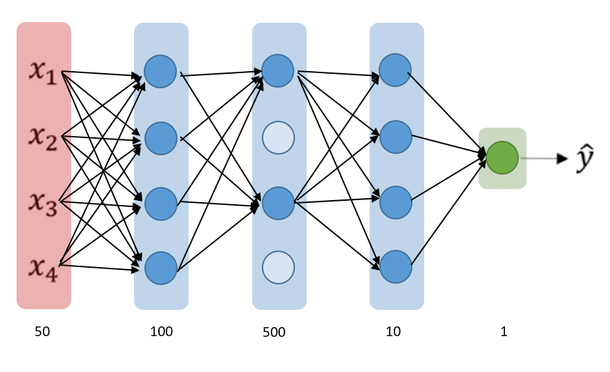
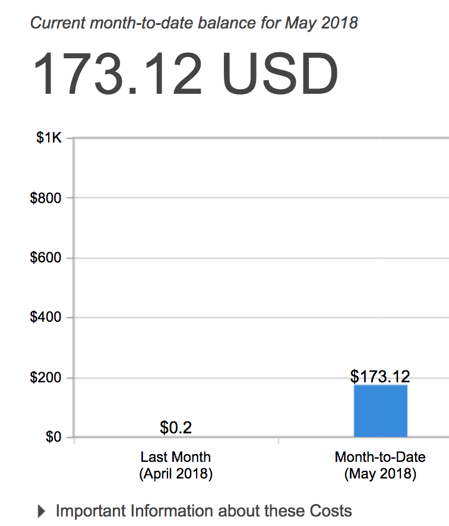
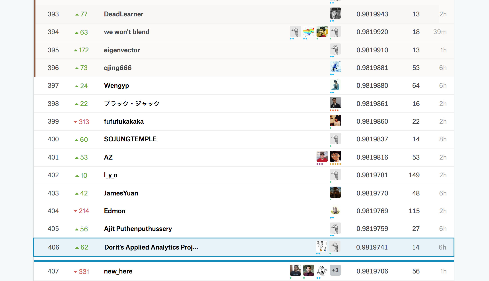

# TalkingData  Fraud Detection

## 1.0 Background and Introduction

### 1.1 TalkingData Company
---

> Founded in 2011, TalkingData is China’s largest independent **Big Data service platform**. ... include **industry-leading solutions** such as mobile app & gaming analytics, mobile ad tracking, enterprise Smart Marketing Cloud, and consulting. 

Generally speaking, [TalkingData](https://www.talkingdata.com/product-AdTracking.jsp?languagetype=en_us) is a third-party platform, which provides analytics for small and medium-sized mobile applications.

### 1.2 TalkingData's AdTracking Service
---

TalkingData's AdTracking Service provides business insights using mobile's clicking amount in a short period (mainly for **advertisements**). Like an outsourcing service, TalkingData will charge you in different modes. 

### 1.3 TalkingData's Anti-Cheating Service
---
If we are using the AdTracking Service, we will have this dashboard to monitor our applications operations situations. For the Anti-Cheating part, TalkingData will rank the "Fraud Click" based on several calculations. Even if we want to explore more about this service, we still stop here because we need to register an account.
 

## 2.0 Business Value and Objective

This section will explain the business value of this project and data competition. Based on these business values, our objective and task are valuable not only for TalkingData but also data mining.

#### 2.1 Pay-per-click (PPC) Business Model
---

For some mobile applications (ios or Android), they are using Pay-per-click (PPC) model, which will help direct traffic to their applications. Generally speaking, they want to increase the number of downloads using internet advertising company. If users click this advertisement, the advertising company will charge based on each click. Overall, higher click volume will lead to high download rate. This part is related to **Click-through rate (CTR)**.

Figure is from [https://www.kaggle.com/c/talkingdata-adtracking-fraud-detection/discussion/54765](https://www.kaggle.com/c/talkingdata-adtracking-fraud-detection/discussion/54765)

**Motivation to cheat:** High Click Times will increase these company's income and demostrate the importance of one certain channel but the application download times will not increase.

#### 2.2 Malicious Parties
---

Besides the advertising companies, competitors and other **malicious parties** will use clicks to affect the daily operation of mobile applications. These actions will increase the workload of the current server.

**Motivation to cheat** "Attack" the server with malicious purposes.

#### 2.3 Objective

With all these information, our task is to detect the "click fraud" behavior. To achieve this goal, in this document, we want to estimate :

- **Probability of Application Download**: Predicted probability of each click to download the application 
- Low probability : Fraud Click 
- High probability : Real Click

## 3.0 Data Exploration 

Because the total training data size is really **huge** (184 million lines), we only use part of the data (100k lines) for exploration analysis in my dataset. To quickly start to understand the dataset, we borrow ideas from other people's exploratory data analysis (which saves much time for us). 

### 3.1 Data Basic Information

- Time Period : From **2017-11-06** to **2017-11-09** (4 days)
- Original Fields : 7 variables and 1 target variables

All fields are as follow :

| Variable Name  | Explanation | Example |
| ------------- | ------------- |------------- |
| IP  | IP address of click  | 87540|
| app  | app id for marketing  |12|
|device| device type id of user mobile phone (e.g., iPhone 6 plus, iPhone 7, Huawei mate 7, etc.)|1|
|os| os version id of user mobile phone|13|
|channel| channel id of mobile ad publisher|497|
|click_time| timestamp of click (UTC)|    2017-11-07 09:30:38|
|attributed_time| if user download the app for after clicking an ad, this is the time of the app download| NaN|
|is_attributed| the target that is to be predicted, indicating the app was downloaded|0|

Actual Dataset :

#### Main Challenge :

- **Data Size**: Large data is very hard to train and it takes time
- **Few Fields**: Unlike another dataset, all these fields are few and not directly related to final prediction.

In this project, llthough we don't need to clean some data, we actually focus more time on feature engineering than other Kaggle competitions.

### 3.2 Data Distribution

To save time, I borrow some figures from: [https://www.kaggle.com/yuliagm/talkingdata-eda-plus-time-patterns](https://www.kaggle.com/yuliagm/talkingdata-eda-plus-time-patterns) and [https://www.kaggle.com/yuliagm/talkingdata-eda-plus-time-patterns](https://www.kaggle.com/yuliagm/talkingdata-eda-plus-time-patterns)

**Unique Values:** At first, we want to figure out the unique values of all different features. This will help us to determine our next steps of feature engineering.** 

Actually, the above figure makes sense. Generally speaking, users will visit the app store with different IPs to download limited applications. Although using different devices, they may be directed by certain **channels**. Because this may be their directly related to their final objective.

**Target Variable Distribution:** In terms of the actual download percentage:

Among all data, the actual conversion rate is quite low. However, this conversion rate is **too low**, which means that the dataset has many fraud clicks. 

**Time Pattern:** Without figuring out the contribution of actual IP or devices, we want to know more about the time pattern

From the above graph, people will click this dataset mainly from 23 pm to 15 pm. It is not realistic. **Who will click the app from 3 am - 5 am?** Also, the bellow figure does not make sense for me.

### 3.3 Insights and Assumptions    

To create more useful features, we need to understand the behaviors of fraud "users". Through making some assumptions, I try to extend features step by step.

---

#### Assumptions 1.0: Fraud clicks many links to a certain channel.

If I want to cheat using programming script, I will try to **mask my IP address**. Based on my own web crawler experience, I will use an IP pool to mask my IP addresses. However, I can't mask the "fingerprint" - operating system (os) and other information. 

For example, if I need to increase the click amount for a certain app in a certain channel, we may use our current devices although we also will apply some anti-detection approaches. As a consequence, **the device, os and other information should be the same.**

**Conclusion A: Devices and OS or other fields may appear concurrently.**

---

#### Assumptions 2.0 : Time Pattern

If a new click happens, we can check **historical data** based on the timeline and then judge whether this is a fraud click. As a result, we should focus on time feature. 

For example, the interval between two clicks may be a very important feature. Or, later, we only calculate the difference between current date and 1970-1-1:00:00:00.

**Conclusion B: Time related features will make sense.**

---

#### Assumptions 3.0 : Some "cheaters" are not so "smart".

For some technical reasons, some cheaters may not change IP address frequently. If the IP address is blocked, they can change IP immediately.

For them, changing IP address increases cost for them. They would like to be blocked at first. Then, they will change their IP address. This is the most convenient method.

**Conclusion 3.0: IP addresses are still important in our dataset.**
 
 
## 4.0 Feature Engineering

We borrow ideas from [https://www.kaggle.com/nanomathias/feature-engineering-importance-testing](https://www.kaggle.com/nanomathias/feature-engineering-importance-testing) This Kaggle kernel is the most insightful kernel for feature engineering based on many previous kernels. It guides us to generate similar features at first.

### 4.1 Feature Creation

In this part, we mainly create 8 features categories.

#### 4.1.0 Preprocessing Time Features

To prepare for later feature engineering, all time features have been created at first. These features include day, hour, minute and seconds.

#### 4.1.1 Next Click 

After sorting all data based on time, all data will be grouped by similar device, os or other informations (no more than three combinations). After this, we will calculate the time differences to for each record using similar app, os or other information. To help training process, we fill all missing valeus with -99. 

#### 4.1.2 Previous Click 

Similar to **Next Click**, we also check back about the data. This part will be shown together with Cumulate Sum.

#### 4.1.3 Cumulate Sum

After grouping all data, we calculate the cumulate sume of concurrency. 

#### 4.1.4 Statistics

Using similar strategies, we also calculate the mean, variance, count and unique values of concurrency of each groups. Mean and variance is calculated because they measure the stationary of certain data series. If the series fluctuates frequently, these metrics will have large changes. Unique values will provide some information if same combinations have show up in our historical records.

- 4.Mean 
- 5.Variance
- 6.Count
- 7.Unique Values

#### 4.1.5 Original Features

We also use the original 7 features including IP, Devices and so on. 

- 8.Original Features

#### 4.1.6 Summary 

Based on previous analysis and feature engineering, we use and create 8 categories features for our models. Even though some features may not work very well, we just creat them together and check them one by one. 

Actually, in the common kenels, many other features are used. For example, some people calculate prior probability like Prob(Click | Device). This feature can only be calculated in training process not in test dataset.

### 4.2 Feature Importance

At first, we try to use XGBoost (boosting trees) to build the model. However, our personal computer will load the whole trian and test dataset for more than 5 mins (180 M lines for each file). Due to insufficient RAM, we try to find some solutions from Kaggle discussion part. 

**Suggesstions**:

- Build Database using SQL to load data
- Using Lightgbm to train the model
- Using other python packages like Feature or pickle
- Using cloud computing power

In our example, this is part of our feature records using same dataset and same hyperparamters. We modify this [script](https://www.kaggle.com/asraful70/talkingdata-added-new-features-in-lightgbm/code) using Lightgbm and run this script in Amazon Web Server - Elective Container 2 (AWS EC2) to derive our final feature importance. We run the dataset many times. The issue here is that these feature importances may change if we use different dataset to generate the result. As a consequence, we relize that we should try to use different parts of the dataset to train our model.

**First Round Filter:** At first, we keep all features will accuracy more than 0.95 from the validation set. However, we notice that these featutures are very likely to be overfitting. 

**Second Round Filter:** Although correlation matrix will help us identify relationship between different features, we finally decided to use Lightgbm feature importance figure to guide use. Below graph is the feature importance (We use X0 to X8 because too many combinations, which makes it hard to find corresponding code to modify...).

**Third Round Filter:** Some features related to time are very important. However, our current algorithems are very slow to compute all required features. As a consequence, we use some "rough" calculations to replace "accurate" calculations. This approach is manily prepared for time related features.  

**Computing Power Assistance**

To achieve this, we deploy AWS EC2 m4.16xlarge instance to train our model. We are very busy with current **take-home exams**. Moreover, to compute all data rapidly, we need many CPUs and RAM for accelartion of current training process. Even if we use this powerful instance, each training will cost 2-3 hours. Each model will occupy nearly 13.3 GB RAM. Each time, we will train nearly 8 models (This will be discussed later). And, we only have no more than three days for this competition.  

[Figure Link](https://aws.amazon.com/blogs/aws/expanding-the-m4-instance-type-new-m4-16xlarge/)

## 5.0 Modelling

### 5.1 Chaning Dataset and hyperparameters - Lightbgm and Neutral Network

Our first model is Lightbgm and next it netrual networks. Because Lightgbm and XBoost are very very similar. So, we want to use these "familar" models. According to the kernels at that time, people have relized that different dataset will have different results. As a reuslt, we build many Lightgbm models using different dataset. 

Af first, we will split our training dataset based on different days - Day 6, Day 7, Day 8, Day 9. This also corresponds to our insights from time pattern (no time patterns). 

For the training part, we use Day 6, Day 7, Day 8 and Day 9 seperately to train the model, then Day 6, Day 7, Day 8 and Day 9 as validation dataset. Day 6 has 10M data, Day 7 has 50M, Day 8 has 50M, Day 9 has 40M.

Genarlly Speaking models are as follow : (Here.. I forget the results.. )

| Training Dataset  | Validation Dataset | 
| ------------- | ------------- |
| Day 6  | Day 6  | 
| Day 7  | Day 7  |
| Day 8| Day 8 |
|Day 9| Day 9 |
|Day 6| Day 7 |
|Day 6| Day 8|    
|...| ...| 

After confirming the dataset to use as trianing and validating dataset, we try to trune the parameters. (Here, we also use the full dataset to train the model, this gives us better result.) Here, we have nearly **10-30 models**, I don't remember actually. Because I blend each ten models and submit it to public board to test my guess and model. Then, we will decide next steps.

### 5.2 Self-defined Models

We build a model using previous models.

#### 5.2.1 Feature Generation

Inspired by previous models, we use 8 neural networks  (multi-layer perceptions) to train each feature categories. Although our netural networks are not so deep, each layers has many units. This NN structure makes our model very very easily overfiting. To control these, we use dropout for all hidden layers **(drop 50% neutros)**.

**Neutral Network Framework:**

- Input Layer : 50 units 
- Hidden Layer 1 : 100 units + Relu + 0.5 Dropout
- Hidden Layer 2 : 500 units + Relu + 0.5 Dropout
- Hidden Layer 3 : 10 units + Relu + 0.5 Dropout
- Output Layer : 1 unite + sigmoid 
- Loss Function : Binary Loss 
- Metrics : Accuracy

We do not use the final output as new features. However, **we extract the hidden layer 3 as the features.** In that sense, we will have 80 features (8*10). Actually, this feature matrix is sprase matrix with many zeros because we force it to genearte 10 features for each category. (Some category only has 2-4 features as input). 

This part will add **very very strong reguliraztion** for this neutral networks. 

#### 5.2.2 XGboost

After previous step, we merge all current features together and send all these features to next model - XGBoost. We also add a very strong regularization. This part is very similar to Lightgbm.

#### 5.2.3 Whole Frame

pic single

We split all data into 4 datasets - day 6 .. day 9. And using each single model unit to train one day data. (train dataset day 6 to predict test dataset day 6)  Then, we put them together as the final predictions. 

two pics

### 5.3 Model Blend

We use simple mean of all current model results to blend all model predictions. This actually gives us a more stable result although we lose the probability to reach a very high score.

According to Kaggle's rules, each team can only submits their predictions 5 times per day. To save our submisstion times, we blend similar model's preditions at first and then submit it to Kaggle.

I have limited time during this competition both physically and psychologically. I don't write some script to records all log and other paratmerts. This leads me to 

## 6.0 Final Result and Feelings

### 6.1 Feeling about this project

Because we are not interested in the given dataset, Kaggle competition seems more appealing for us. Driven by this motivation, we finally choose this dataset.

We worry about this dataset is too clean. So, we spend lots of time for feature engineering and modeling part. We run our current framework locally and then upload to AWS EC2. Unfortunately, all files do not be calculated finally, even if we spend a lot of money on it.

Genarlly speaking, I still find my coding ability needs to improve. With rich Kaggle hands-on experience, this time, I have tried to build everything using a well-defined framework. However, from other people's Github, I find that I still need to have a very good framework, which should record all paramters and results of public score from Kaggle. As a result, I can better control our local validation reuslt.

### 6.2 Feeling about Kaggle

Although in the last few hours someone shares his high-score solution, our ranking drop rapidly from the leader board. I care more about what I have learned from this competition.

After waiting for a long time, I carefully read the solutions provided by 4th place, 11th place and 3rd place. I have similar feelings everytime. They control all features in very tiny details. 

Although my thoughts are on the right way, details amplifies all discrenpancy. For example, 3rd place solutions (current Kaggle 1st ranking grandmaster) also uses neutral networks. But he controls overfitting very well. Moreover, he uses many very good features.

