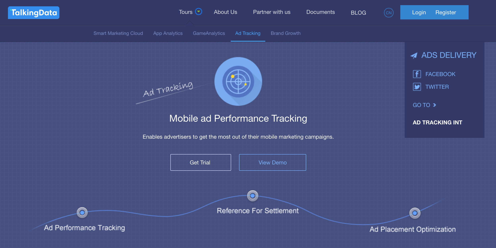

# TalkingData  Fraud Detection

## 1. Barckground and Introduction

### 1.1 TalkingData Company
------------


> Founded in 2011, TalkingData is China’s largest independent **Big Data service platform**. ... include **industry-leading solutions** such as mobile app & gaming analytics, mobile ad tracking, enterprise Smart Marketing Cloud, and consulting. 

Genearlly speaking, [TalkingData](https://www.talkingdata.com/product-AdTracking.jsp?languagetype=en_us) is a third-party platform, which provides analytics for small and medium size moblie applications.

### 1.2 TalkingData's AdTracking Service
------------

TalkingData's AdTracking Service provides business insights using mobile's clicking amoungt in a short period (mainly for **advertisements**). Like an outsourcing service, TalkingData will charge you in different modes. 



### 1.3 TalkingData's Anti-Cheating Service
------------

If we are using the AdTracking Service, we will have this dashboard to monitor our applications operations situations. For Anti-Cheating part, TalkingData will rank the "Fraud Click" based on several calculations. Even if we want to explore more about this service, we still stop here because we need to register an account.
 


### 1.4 Business Value and Objective
------------

#### 1.4.1 Pay-per-click (PPC) Business Model

For some mobile applications (ios or Android), they are using Pay-per-click (PPC) model, which will help direct traffic to their applications. Genearlly speaking, they want to increase the number of downloads using internet advertising companys. If users click this advertisment, the advertising company will charge based on each click. 

Overall, higher click volume will lead to high download rate. This part is related to **Click-through rate (CTR)**.

**Motivation to cheat:** High Click Times will increase these company's income but the application download times will not increase.

#### 1.4.2 


With all these informaiton, our task is to predict the **probility of download the mobile application** using given data. 


You can use the [editor on GitHub](https://github.com/yangz10/TalkingData-AdTracking-Fraud-Detection/edit/master/README.md) to maintain and preview the content for your website in Markdown files.

Whenever you commit to this repository, GitHub Pages will run [Jekyll](https://jekyllrb.com/) to rebuild the pages in your site, from the content in your Markdown files.

### Markdown

Markdown is a lightweight and easy-to-use syntax for styling your writing. It includes conventions for

```markdown
Syntax highlighted code block

# Header 1
## Header 2
### Header 3

- Bulleted
- List

1. Numbered
2. List

**Bold** and _Italic_ and `Code` text

[Link](url) and 
```

For more details see [GitHub Flavored Markdown](https://guides.github.com/features/mastering-markdown/).

### Jekyll Themes

Your Pages site will use the layout and styles from the Jekyll theme you have selected in your [repository settings](https://github.com/yangz10/TalkingData-AdTracking-Fraud-Detection/settings). The name of this theme is saved in the Jekyll `_config.yml` configuration file.

### Support or Contact

Having trouble with Pages? Check out our [documentation](https://help.github.com/categories/github-pages-basics/) or [contact support](https://github.com/contact) and we’ll help you sort it out.
