# TalkingData  Fraud Detection

## 1. Background and Introduction

### 1.1 TalkingData Company
---

> Founded in 2011, TalkingData is China’s largest independent **Big Data service platform**. ... include **industry-leading solutions** such as mobile app & gaming analytics, mobile ad tracking, enterprise Smart Marketing Cloud, and consulting. 

Generally speaking, [TalkingData](https://www.talkingdata.com/product-AdTracking.jsp?languagetype=en_us) is a third-party platform, which provides analytics for small and medium-sized mobile applications.

### 1.2 TalkingData's AdTracking Service
---

TalkingData's AdTracking Service provides business insights using mobile's clicking amount in a short period (mainly for **advertisements**). Like an outsourcing service, TalkingData will charge you in different modes. 

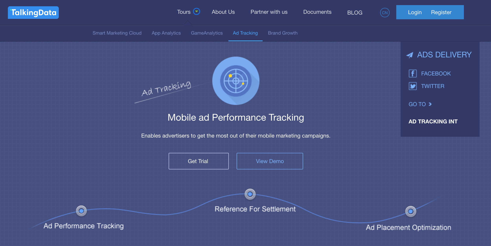

### 1.3 TalkingData's Anti-Cheating Service
---
If we are using the AdTracking Service, we will have this dashboard to monitor our applications operations situations. For the Anti-Cheating part, TalkingData will rank the "Fraud Click" based on several calculations. Even if we want to explore more about this service, we still stop here because we need to register an account.
 
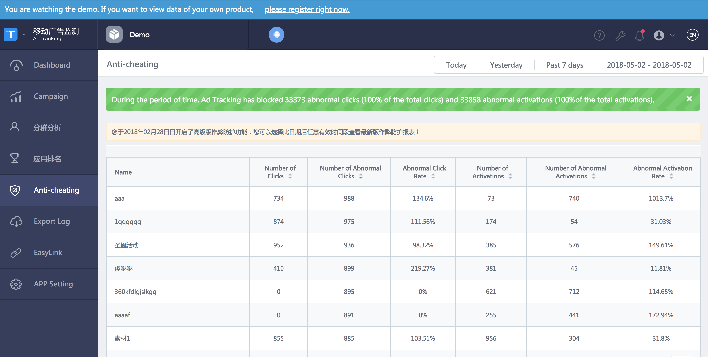

## 2.0 Business Value and Objective

This section will explain the business value of this project and data competition. Based on these business values, our objective and task are valuable not only for TalkingData but also data mining.

#### 2.1 Pay-per-click (PPC) Business Model
---

For some mobile applications (ios or Android), they are using Pay-per-click (PPC) model, which will help direct traffic to their applications. Generally speaking, they want to increase the number of downloads using internet advertising company. If users click this advertisement, the advertising company will charge based on each click. Overall, higher click volume will lead to high download rate. This part is related to **Click-through rate (CTR)**.

Figure is from [https://www.kaggle.com/c/talkingdata-adtracking-fraud-detection/discussion/54765](https://www.kaggle.com/c/talkingdata-adtracking-fraud-detection/discussion/54765)

**Motivation to cheat:** High Click Times will increase these company's income and demostrate the importance of one certain channel but the application download times will not increase.

#### 2.2 Malicious Parties
---

Besides the advertising companies, competitors and other **malicious parties** will use clicks to affect the daily operation of mobile applications. These actions will increase the workload of the current server.

**Motivation to cheat** "Attack" the server with malicious purposes.

#### 2.3 Objective

With all these information, our task is to detect the "click fraud" behavior. To achieve this goal, in this document, we want to estimate :

- **Probability of Application Download**: Predicted probability of each click to download the application 
- Low probability : Fraud Click 
- High probability : Real Click

## 3. Data Exploration 

Because the total training data size is really **huge** (184 million lines), we only use part of the data (100k lines) for exploration analysis in my dataset. To quickly start to understand the dataset, we borrow ideas from other people's exploratory data analysis (which saves much time for us). 

### 3.1 Data Basic Information

- Time Period : From **2017-11-06** to **2017-11-09** (4 days)
- Original Fields : 7 variables and 1 target variables

All fields are as follow :

| Variable Name  | Explanation | Example |
| ------------- | ------------- |------------- |
| IP  | IP address of click  | 87540|
| app  | app id for marketing  |12|
|device| device type id of user mobile phone (e.g., iPhone 6 plus, iPhone 7, Huawei mate 7, etc.)|1|
|os| os version id of user mobile phone|13|
|channel| channel id of mobile ad publisher|497|
|click_time| timestamp of click (UTC)|    2017-11-07 09:30:38|
|attributed_time| if user download the app for after clicking an ad, this is the time of the app download| NaN|
|is_attributed| the target that is to be predicted, indicating the app was downloaded|0|

Actual Dataset :

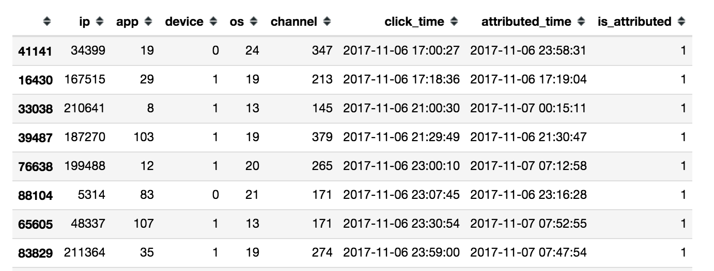

#### Main Challenge :

- **Data Size**: Large data is very hard to train and it takes time
- **Few Fields**: Unlike another dataset, all these fields are few and not directly related to final prediction.

In this project, llthough we don't need to clean some data, we actually focus more time on feature engineering than other Kaggle competitions.

### 3.2 Data Distribution

To save time, I borrow some figures from: [https://www.kaggle.com/yuliagm/talkingdata-eda-plus-time-patterns](https://www.kaggle.com/yuliagm/talkingdata-eda-plus-time-patterns) and [https://www.kaggle.com/yuliagm/talkingdata-eda-plus-time-patterns](https://www.kaggle.com/yuliagm/talkingdata-eda-plus-time-patterns)

**Unique Values:** At first, we want to figure out the unique values of all different features. This will help us to determine our next steps of feature engineering.** 

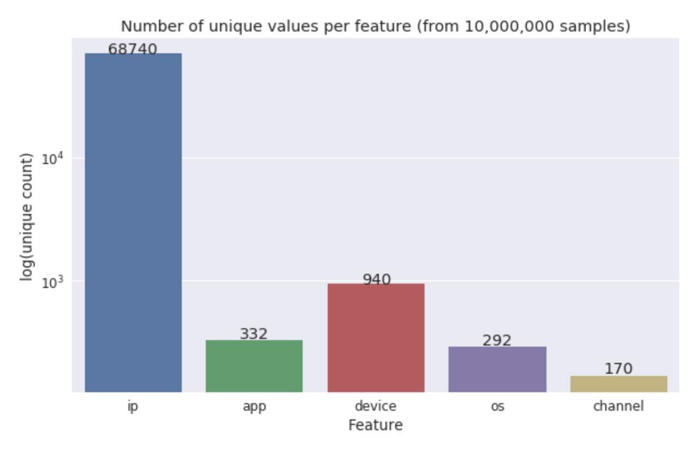

Actually, the above figure makes sense. Generally speaking, users will visit the app store with different IPs to download limited applications. Although using different devices, they may be directed by certain **channels**. Because this may be their directly related to their final objective.

**Target Variable Distribution:** In terms of the actual download percentage:

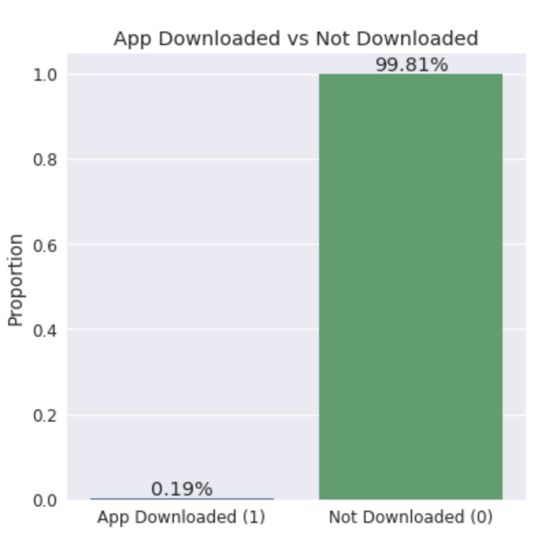

Among all data, the actual conversion rate is quite low. However, this conversion rate is **too low**, which means that the dataset has many fraud clicks. 

**Time Pattern:** Without figuring out the contribution of actual IP or devices, we want to know more about the time pattern

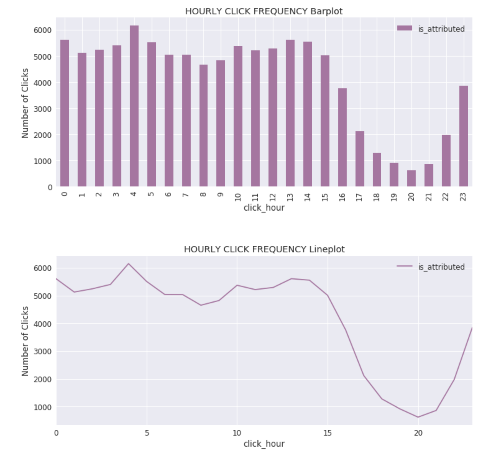

From the above graph, people will click this dataset mainly from 23 pm to 15 pm. It is not realistic. **Who will click the app from 3 am - 5 am?** Also, the bellow figure does not make sense for me.

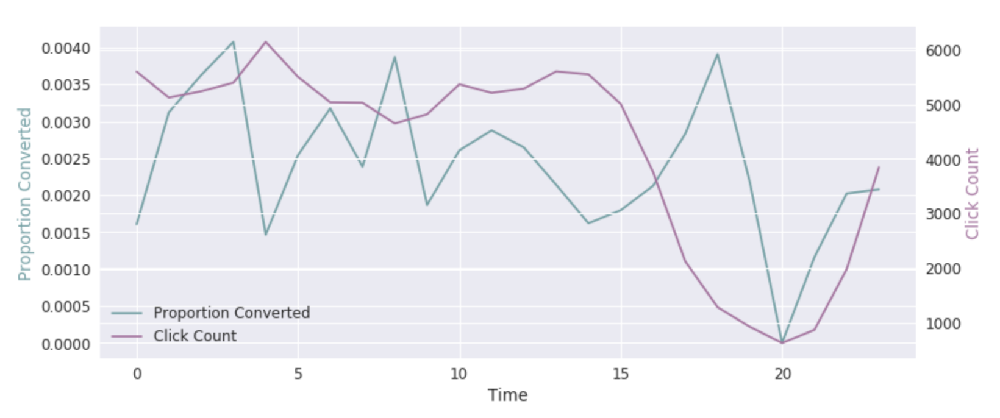

### 3.3 Insights and Assumptions    

To create more useful features, we need to understand the behaviors of fraud "users". Through making some assumptions, I try to extend features step by step.

---

#### Assumptions 1.0: Fraud clicks many links to a certain channel.

If I want to cheat using programming script, I will try to **mask my IP address**. Based on my own web crawler experience, I will use an IP pool to mask my IP addresses. However, I can't mask the "fingerprint" - operating system (os) and other information. 

For example, if I need to increase the click amount for a certain app in a certain channel, we may use our current devices although we also will apply some anti-detection approaches. As a consequence, **the device, os and other information should be the same.**

**Conclusion A: Devices and OS or other fields may appear concurrently.**

---

#### Assumptions 2.0 : Time Pattern

If a new click happens, we can check **historical data** based on the timeline and then judge whether this is a fraud click. As a result, we should focus on time feature. 

For example, the interval between two clicks may be a very important feature. Or, later, we only calculate the difference between current date and 1970-1-1:00:00:00.

**Conclusion B: Time related features will make sense.**

---

#### Assumptions 3.0 : Some "cheaters" are not so "smart".

For some technical reasons, some cheaters may not change IP address frequently. If the IP address is blocked, they can change IP immediately.

For them, changing IP address increases cost for them. They would like to be blocked at first. Then, they will change their IP address. This is the most convenient method.

**Conclusion 3.0: IP addresses are still important in our dataset.**
 
 
## 4.0 Feature Engineering

We borrow ideas from [https://www.kaggle.com/nanomathias/feature-engineering-importance-testing](https://www.kaggle.com/nanomathias/feature-engineering-importance-testing) This Kaggle kernel is the most insightful kernel for feature engineering based on many previous kernels. It guides us to generate similar features at first.

### 4.1 Feature Creation

In this part, we mainly create 8 features categories.

#### 0. Preprocessing Time Features

To prepare for later feature engineering, all time features have been created at first. These features include day, hour, minute and seconds.

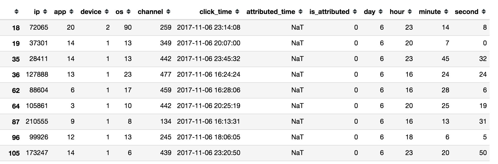

#### 1.Next Click 

After sorting all data based on time, all data will be grouped by similar device, os or other informations (no more than three combinations). After this, we will calculate the time differences to for each record using similar app, os or other information. To help training process, we fill all missing valeus with -99. 

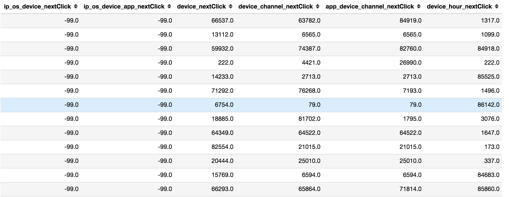

#### 2.Previous Click 

Similar to **Next Click**, we also check back about the data. This part will be shown together with Cumulate Sum.

#### 3.Cumulate Sum

After grouping all data, we calculate the cumulate sume of concurrency. 

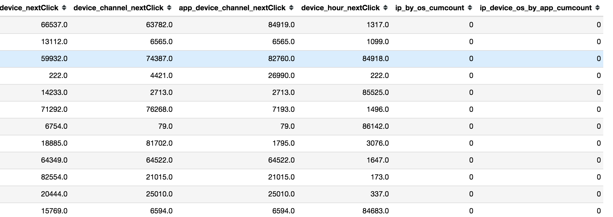

#### 4.Statistics

Using similar strategies, we also calculate the mean, variance, count and unique values of concurrency of each groups. Mean and variance is calculated because they measure the stationary of certain data series. If the series fluctuates frequently, these metrics will have large changes. Unique values will provide some information if same combinations have show up in our historical records.

- 4.Mean 
- 5.Variance
- 6.Count
- 7.Unique Values

#### 6.Original Features

We also use the original 7 features including IP, Devices and so on. 

- 8.Original Features

#### Summary 

Based on previous analysis and feature engineering, we use and create 8 categories features for our models. Even though some features may not work very well, we just creat them together and check them one by one. 

Actually, in the common kenels, many other features are used. For example, some people calculate prior probability like Prob(Click | Device). This feature can only be calculated in training process not in test dataset.

### 4.2 Feature Importance

At first, we try to use XGBoost (boosting trees) to build the model. However, our personal computer will load the whole trian and test dataset for more than 5 mins (180 M lines for each file). Due to insufficient RAM, we try to find some solutions from Kaggle discussion part. 

**Suggesstions**:

- Build Database using SQL to load data
- Using Lightgbm to train the model
- Using other python packages like Feature or pickle
- Using cloud computing power

In our example, this is part of our feature records using same dataset and same hyperparamters. We modify this [script](https://www.kaggle.com/asraful70/talkingdata-added-new-features-in-lightgbm/code) using Lightgbm and run this script in Amazon Web Server - Elective Container 2 (AWS EC2) to derive our final feature importance. We run the dataset many times. The issue here is that these feature importances may change if we use different dataset to generate the result. As a consequence, we relize that we should try to use different parts of the dataset to train our model.

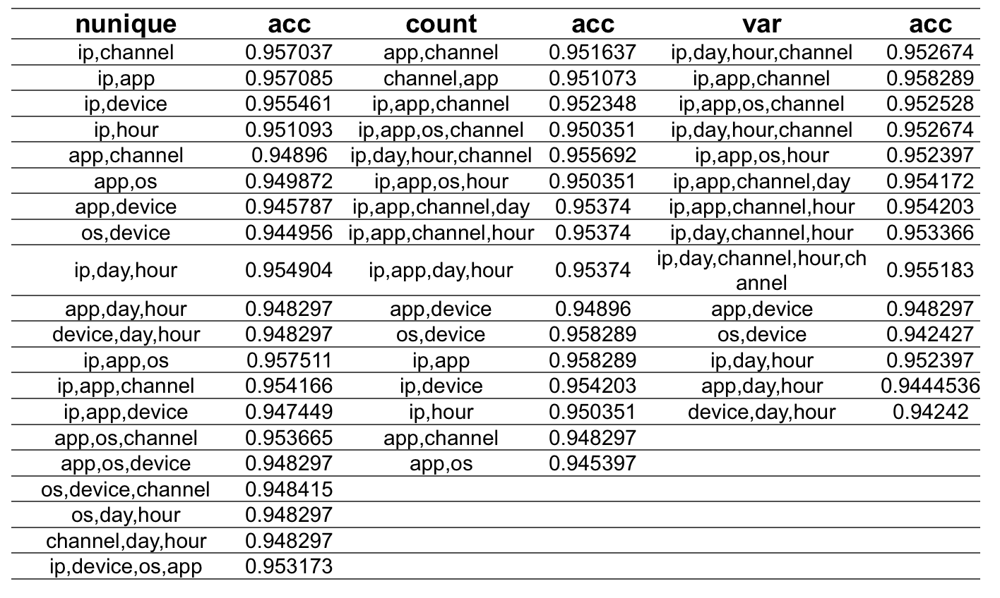

**First Round Filter:** At first, we keep all features will accuracy more than 0.95 from the validation set. However, we notice that these featutures are very likely to be overfitting. 

**Second Round Filter:** Although correlation matrix will help us identify relationship between different features, we finally decided to use Lightgbm feature importance figure to guide use. Below graph is the feature importance (We use X0 to X8 because too many combinations, which makes it hard to find corresponding code to modify...).

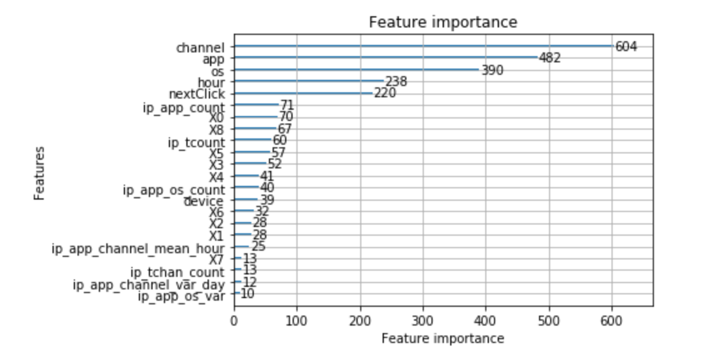

To achieve this, we deploy AWS EC2 m4.16xlarge instance to train our model. We are very busy with current take-home exams. Moreover, to compute all data rapidly, we need many CPUs and RAM for accelartion of current training process. Even if we use this powerful instance, each training will cost 2-3 hours. Each model will occupy nearly 13.3 GB RAM. Each time, we will train nearly 8 models (This will be discussed later).  

[Figure Link](https://aws.amazon.com/blogs/aws/expanding-the-m4-instance-type-new-m4-16xlarge/)

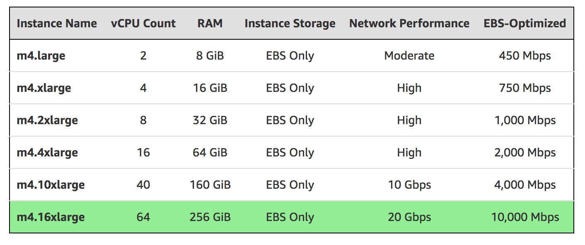

#### 5. Deep Learning

After creating the final metrics, we use neural networks (multi-layer perceptions) to help us do feature engineering. A very deep neutral network helps us transform each category features at first. Then, we compress all these data into 10 dimensions. With the final target, we extract the hidden layers as new features.

## 5.0 Modelling

